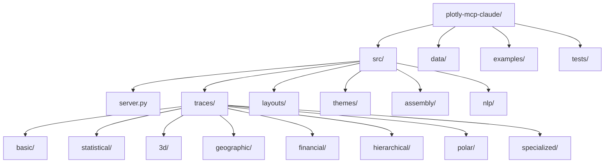
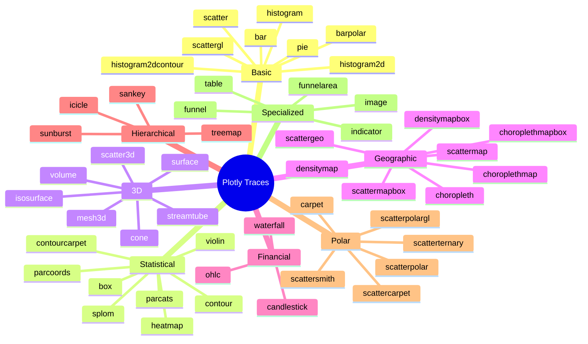
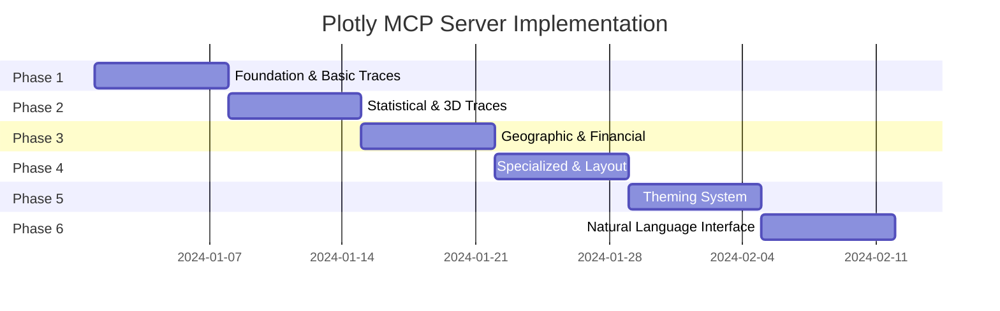
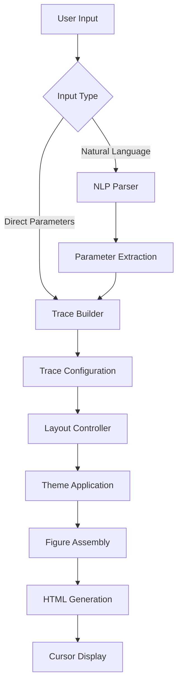

# Plotly MCP Server - Implementation Plan

## Project Overview
**Goal**: Graph Objects-only Plotly MCP server for Cursor  
**Output**: HTML visualizations from natural language  
**Control**: Minute-level customization of all chart elements  
**Scope**: Complete coverage of 50+ Plotly trace types  

## Project Structure



### Directory Structure
```
plotly-mcp-claude/
??? src/
?   ??? server.py              # Main MCP server
?   ??? traces/                # All trace builders (50+ types)
?   ?   ??? basic/             # scatter, bar, line, pie, histogram
?   ?   ??? statistical/       # box, violin, heatmap, contour
?   ?   ??? 3d/               # scatter3d, surface, mesh3d, volume
?   ?   ??? geographic/        # choropleth, scattergeo, density
?   ?   ??? financial/         # candlestick, ohlc, waterfall
?   ?   ??? hierarchical/      # treemap, sunburst, icicle, sankey
?   ?   ??? polar/             # scatterpolar, carpet, smith
?   ?   ??? specialized/       # funnel, indicator, image, table
?   ??? layouts/              # Layout controllers
?   ?   ??? axes.py           # x/y/z axis configuration
?   ?   ??? styling.py        # colors, fonts, spacing
?   ?   ??? interactions.py   # hover, zoom, animations
?   ??? themes/               # Styling system
?   ?   ??? presets.py        # sci-fi, corporate, dark
?   ?   ??? custom.py         # theme builder
?   ??? assembly/             # Figure building
?   ?   ??? builder.py        # combine traces + layout
?   ?   ??? optimizer.py      # performance tuning
?   ??? nlp/                  # Natural language (Phase 5)
?       ??? parser.py         # text to chart parameters
??? data/                     # Sample datasets
??? examples/                 # Usage examples per trace type
??? tests/                    # Unit tests for all traces
??? requirements.txt
??? pyproject.toml
??? README.md
```

## Complete Plotly Trace Types



### Trace Count by Category
- **Basic Charts**: 8 types
- **Statistical Charts**: 8 types  
- **3D Charts**: 7 types
- **Geographic Charts**: 8 types
- **Financial Charts**: 3 types
- **Hierarchical Charts**: 4 types
- **Polar & Coordinates**: 6 types
- **Specialized Charts**: 5 types

**Total: 49 trace builders required**

## Implementation Timeline



### Phase 1: Foundation (Week 1)
**Setup & Basic Traces**
- MCP server with FastMCP framework
- Project structure for 49 trace types
- Basic traces: scatter, bar, line, pie, histogram
- Figure assembly system
- Cursor integration testing

**Deliverable**: 5 basic chart types working in Cursor

### Phase 2: Core Traces (Week 2)  
**Statistical & 3D Traces**
- Statistical traces: box, violin, heatmap, contour, splom, parcoords, parcats, contourcarpet
- 3D traces: scatter3d, surface, mesh3d, volume, isosurface, cone, streamtube
- Error handling for all implemented traces

**Deliverable**: 20 chart types total (5 + 15 new)

### Phase 3: Advanced Traces (Week 3)
**Geographic & Financial Traces**
- Geographic traces: choropleth, choroplethmap, choroplethmapbox, scattergeo, scattermap, scattermapbox, densitymap, densitymapbox
- Financial traces: candlestick, ohlc, waterfall
- Hierarchical traces: treemap, sunburst, icicle, sankey

**Deliverable**: 35 chart types total (20 + 15 new)

### Phase 4: Complete Traces & Layout (Week 4)
**Remaining Traces & Layout System**
- Polar traces: scatterpolar, scatterpolargl, scattersmith, scatterternary, carpet, scattercarpet
- Specialized traces: funnel, funnelarea, indicator, image, table
- Complete layout system: axes, styling, interactions
- Performance optimization

**Deliverable**: All 49 trace types complete with layout control

### Phase 5: Theming System (Week 5)
**Professional Styling**
- Theme presets: sci-fi, corporate, dark, minimal
- Custom theme builder
- CSS injection system
- Theme validation and testing
- Performance optimization for styled output

**Deliverable**: Professional styling system for all traces

### Phase 6: Natural Language Interface (Week 6)
**NLP Integration**
- Text parser for all 49 trace types
- Smart parameter inference
- Chart type suggestions based on data
- Error correction and validation
- Natural language to trace parameter mapping

**Deliverable**: Complete natural language interface

## Technical Architecture



## Trace Builder Specification

### Universal Pattern
```python
@mcp.tool()
async def create_{trace_type}_trace(
    # Data parameters
    x_data: list = None,
    y_data: list = None,
    z_data: list = None,  # for 3D traces
    
    # Styling parameters
    colors: str | list = "blue",
    sizes: int | list = 10,
    opacity: float = 1.0,
    
    # Trace-specific parameters
    # ... unique to each trace type
    
    # Universal parameters
    name: str = "trace",
    visible: bool = True,
    show_legend: bool = True,
    hover_template: str = None
) -> dict:
    """Create {trace_type} trace with full customization"""
    return trace_config_dict
```

### Layout Controllers
```python
configure_xaxis(title, range, ticks, grid, type, font)
configure_yaxis(title, range, ticks, grid, type, font)
configure_zaxis(title, range, ticks, grid, type, font)  # 3D only
set_margins(top, bottom, left, right)
configure_legend(position, orientation, font, background)
add_annotations(text, position, styling)
set_hover_behavior(mode, template, styling)
```

### Theme System
```python
apply_theme(chart_html, theme_name)
customize_colors(palette, opacity, gradients)
set_fonts(family, size, weight, color)
inject_custom_css(css_rules)
create_custom_theme(theme_config)
```

### Assembly Tools
```python
create_figure(traces, layout, config)
add_trace_to_figure(figure_html, trace_config)
update_layout(figure_html, layout_updates)
merge_figures(figure_list, arrangement)
optimize_performance(figure_html, options)
```

## Success Metrics
- All 49 Plotly trace types supported
- Sub-second chart generation for all types
- 5+ professional themes working with all traces
- Natural language parsing for all trace types (Phase 6)
- Seamless Cursor integration
- HTML files under 2MB with dependencies
- 95%+ trace parameter coverage

## Technical Requirements
- Python 3.10+
- FastMCP framework
- Plotly 5.x (complete Graph Objects API)
- Pandas for data handling
- Jinja2 for HTML templates
- UV for package management

## Quick Start
```bash
# Setup
cd /Users/arshad/Desktop/personal/code/plotly-mcp-claude
uv init
uv add "mcp[cli]" plotly pandas jinja2

# Development
uv run python src/server.py

# Cursor Integration
# Add to Cursor MCP settings:
# Command: /path/to/uv run python /path/to/src/server.py
```

## Usage Examples

### Phase 1-4 (Direct Tool Calls)
```python
# Basic charts
create_scatter_trace(x_data, y_data, colors="red", sizes=20)
create_bar_trace(x_data, y_data, orientation="v", colors="blue")

# 3D charts
create_surface_trace(x_data, y_data, z_data, colorscale="viridis")
create_scatter3d_trace(x_data, y_data, z_data, sizes=15)

# Geographic
create_choropleth_trace(locations, values, colorscale="blues")
create_scattergeo_trace(locations, sizes, colors)

# Financial
create_candlestick_trace(dates, open_prices, high_prices, low_prices, close_prices)

# Specialized
create_sankey_trace(nodes, links, colors)
create_treemap_trace(labels, parents, values)
```

### Phase 6 (Natural Language)
```
"Create a 3D scatter plot with neon sci-fi styling"
"Make a choropleth world map with population data"
"Generate a candlestick chart with dark corporate theme"
"Build a sankey flow diagram with custom colors"
"Create a violin plot with transparent overlays"
```

## Implementation Notes
- Modular architecture by trace category
- Universal parameters across all traces
- Trace-specific parameters for each type
- Performance optimization for large datasets
- Theme system compatible with all traces
- Comprehensive testing for each trace type
- NLP integration only after core functionality complete